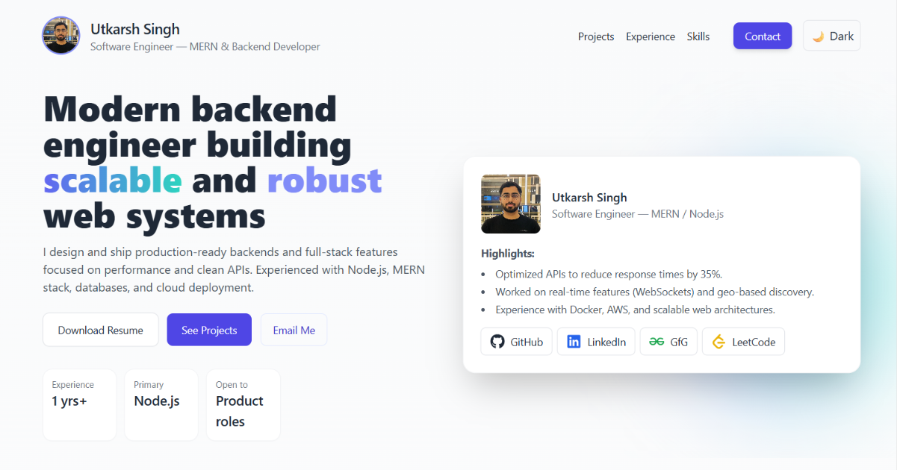

# 🚀 Utkarsh Singh — Portfolio

> 👨‍💻 *Modern Backend Engineer crafting scalable & robust web systems with love for clean APIs and great design.*

🌐 **Live Site:** [utkarsh-portfolio-three.vercel.app](https://utkarsh-portfolio-three.vercel.app/)

---



---

## 👋 About Me

Hi there! I’m **Utkarsh Singh**, a passionate **Software Engineer** specializing in **MERN & Backend Development**. This portfolio showcases my journey, projects, skills, and experience — all wrapped in a sleek dark/light theme.

🎯 **Mission:** Build performant, production-ready web systems that scale.
☁️ **Tech Focus:** Node.js • Express • MongoDB • React • AWS • Docker

---

## 💼 Highlights for Recruiters

✨ **Role:** Software Engineer — MERN / Node.js
🧠 **Focus:** Scalable APIs, performance optimization, real-time systems (WebSockets), and cloud deployment
🚀 **Experience:** Mindnerves Technology | SVAM International Inc.
📫 **Reach me:** [utkarshsingh4345@gmail.com](mailto:utkarshsingh4345@gmail.com)

---

## 🌟 Features

✅ Fully responsive UI with dark/light toggle
🎨 Smooth animations (Framer Motion)
📂 Project cards with hover effects
🕒 Timeline-style experience section
🧰 Skills grid with tech icons
💌 Contact form (Formspree + reCAPTCHA)
📄 Resume download link (PDF)

---

## 🛠️ Tech Stack

| Category           | Tools & Frameworks                        |
| ------------------ | ----------------------------------------- |
| **Frontend**       | React (Vite), Tailwind CSS, Framer Motion |
| **Backend**        | Node.js, Express                          |
| **Database**       | MongoDB, MySQL                            |
| **Cloud & DevOps** | AWS, Docker, Vercel                       |
| **Forms**          | Formspree (no backend required)           |
| **Analytics**      | Google Analytics / Vercel Analytics       |

---

## 🧑‍💻 Local Setup

```bash
git clone https://github.com/utkarshsingh-8/utkarsh-portfolio.git
cd utkarsh-portfolio
npm install
npm run dev
```

🌍 Visit **[http://localhost:5173](http://localhost:5173)** to view your portfolio locally.

---

## ⚙️ Environment Variables (Optional)

| Variable                 | Description                           |
| ------------------------ | ------------------------------------- |
| `VITE_GA_MEASUREMENT_ID` | Google Analytics Measurement ID (GA4) |

Add it to `.env` file or in Vercel Environment settings.

---

## 🚢 Deploying to Vercel

1. Push your repo to GitHub.
2. Import it to [Vercel](https://vercel.com).
3. Build Command → `npm run build`
4. Output Directory → `dist`
5. Enable Analytics for real-time metrics 🚀

Each commit to `main` will automatically redeploy your site.

---

## 🖼️ Adding a Screenshot Preview

1. Capture a clean screenshot of your portfolio (1200×630 px recommended).
2. Save it as `public/preview.png`.
3. Commit & push:

```bash
git add public/preview.png
git commit -m "✨ Added portfolio preview image"
git push origin main
```

---

## 🤝 Connect With Me

<p align="center">
  <a href="https://utkarsh-portfolio-three.vercel.app/" target="_blank">🌐 <b>Portfolio</b></a> •
  <a href="https://www.linkedin.com/in/utkarsh-singh--" target="_blank">💼 <b>LinkedIn</b></a> •
  <a href="https://github.com/utkarshsingh-8" target="_blank">💻 <b>GitHub</b></a> •
  <a href="https://leetcode.com/u/utkarshsingh_8/" target="_blank">🧮 <b>LeetCode</b></a> •
  <a href="https://www.geeksforgeeks.org/user/utkarshsinghthakur1476/" target="_blank">🧠 <b>GeeksforGeeks</b></a> •
  <a href="https://linktr.ee/thakur_utkarsh" target="_blank">🌱 <b>Linktree</b></a>
</p>

---

## 📜 License

This project is licensed under the **MIT License** — feel free to fork, clone, or remix.

---

⭐ *If you like this portfolio, consider giving it a star on GitHub!* ⭐

🖋️ *Last updated: October 2025*
